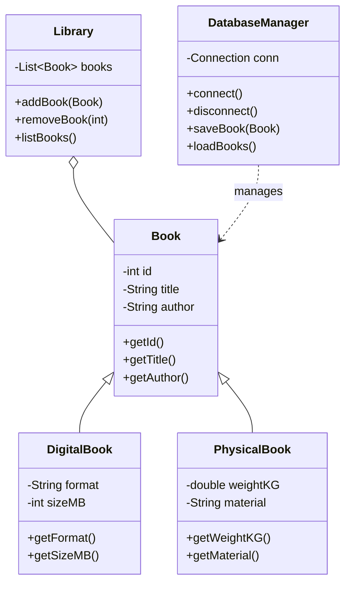
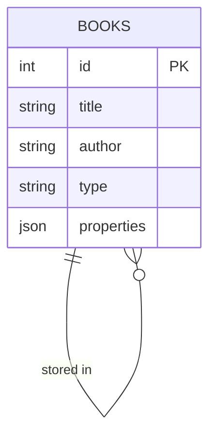

Let's create a practical Java Kata that demonstrates Object-Oriented Programming principles while interacting with a MySQL database. This Kata simulates a simple Library Management System, focusing on core OOP concepts like encapsulation, inheritance, polymorphism, and composition.

### Conceptual Overview

The system consists of three main entities:

- Books (base entity)
- Library (manages books)
- Library Management System (coordinates operations)

Each component follows SOLID principles and demonstrates different aspects of OOP:

1. Encapsulation: Data hiding and controlled access
2. Inheritance: Book hierarchy (Book → DigitalBook → PhysicalBook)
3. Polymorphism: Different book types with unique behaviors
4. Composition: Library contains books

Let's visualize the class structure:



The class diagram shows several important relationships:

- Solid lines with triangles (▷) indicate inheritance: DigitalBook and PhysicalBook inherit from Book
- Diamond line (◇) shows composition: Library owns and manages Books
- Dotted line (...) indicates dependency: DatabaseManager works with Books but doesn't own them
- List~Book~ represents a generic collection of Book objects

Now let's look at our database schema:



The database schema shows:

- A single BOOKS table that stores both physical and digital books
- The 'type' column distinguishes between physical and digital books
- The 'properties' JSON column flexibly stores type-specific attributes (format/size for digital books, weight/material for physical books)
- Self-referential relationship allows for future expansion (e.g., storing book series relationships)

Here's the complete implementation:

```java
// Base Book class demonstrating encapsulation
public abstract class Book {
    private int id;
    private String title;
    private String author;

    public Book(int id, String title, String author) {
        this.id = id;
        this.title = title;
        this.author = author;
    }

    // Getters implementing controlled access
    public int getId() { return id; }
    public String getTitle() { return title; }
    public String getAuthor() { return author; }

    // Abstract method forcing subclasses to implement
    public abstract boolean isValid();
}

// DigitalBook extending Book
public class DigitalBook extends Book {
    private String format;
    private int sizeMB;

    public DigitalBook(int id, String title, String author, String format, int sizeMB) {
        super(id, title, author);
        this.format = format;
        this.sizeMB = sizeMB;
    }

    @Override
    public boolean isValid() {
        return format != null && !format.isEmpty() && sizeMB > 0;
    }
}

// PhysicalBook extending Book
public class PhysicalBook extends Book {
    private double weightKG;
    private String material;

    public PhysicalBook(int id, String title, String author, double weightKG, String material) {
        super(id, title, author);
        this.weightKG = weightKG;
        this.material = material;
    }

    @Override
    public boolean isValid() {
        return weightKG > 0 && material != null && !material.isEmpty();
    }
}

// Library class showing composition
public class Library {
    private List<Book> books;

    public Library() {
        this.books = new ArrayList<>();
    }

    public void addBook(Book book) {
        if (book.isValid()) {
            books.add(book);
        }
    }

    public void removeBook(int id) {
        books.removeIf(book -> book.getId() == id);
    }

    public List<Book> listBooks() {
        return Collections.unmodifiableList(books);
    }
}

// DatabaseManager class handling persistence
public class DatabaseManager {
    private Connection conn;

    public DatabaseManager(String dbUrl, String username, String password) throws SQLException {
        conn = DriverManager.getConnection(dbUrl, username, password);
    }

    public void saveBook(Book book) throws SQLException {
        try (PreparedStatement stmt = conn.prepareStatement(
                "INSERT INTO BOOKS (id, title, author, type, properties) VALUES (?, ?, ?, ?, ?)",
                Statement.RETURN_GENERATED_KEYS)) {
            
            stmt.setInt(1, book.getId());
            stmt.setString(2, book.getTitle());
            stmt.setString(3, book.getAuthor());
            stmt.setString(4, book.getClass().getSimpleName());
            stmt.setString(5, toJson(book));
            stmt.executeUpdate();
        }
    }

    private String toJson(Book book) {
        ObjectMapper mapper = new ObjectMapper();
        try {
            return mapper.writeValueAsString(book);
        } catch (JsonProcessingException e) {
            throw new RuntimeException("Failed to serialize book", e);
        }
    }
}
```

### Usage Example

```java
public class LibraryManagementKata {
    public static void main(String[] args) {
        try {
            // Initialize database manager
            DatabaseManager dbManager = new DatabaseManager(
                    "jdbc:mysql://localhost:3306/library",
                    "root", 
                    "password"
            );

            // Create library instance
            Library library = new Library();

            // Add different types of books
            DigitalBook ebook = new DigitalBook(1, "Clean Code", "Robert Martin", "PDF", 500);
            PhysicalBook paperback = new PhysicalBook(2, "Design Patterns", "GoF", 0.5, "Paper");

            library.addBook(ebook);
            library.addBook(paperback);

            // Save to database
            dbManager.saveBook(ebook);
            dbManager.saveBook(paperback);

        } catch (SQLException e) {
            System.err.println("Database error: " + e.getMessage());
        }
    }
}
```

### Key OOP Concepts Demonstrated

1. **Encapsulation**  - Private fields with public getters
  - Controlled access to sensitive data
  - Internal state management


2. **Inheritance**  - DigitalBook and PhysicalBook extend Book
  - Shared attributes handled in parent class
  - Specialized behavior in child classes


3. **Polymorphism**  - Abstract isValid() method implemented differently
  - Same interface (addBook()) handles different book types
  - Runtime polymorphic behavior


4. **Composition**  - Library contains a collection of Books
  - Clear ownership and lifecycle management
  - Proper encapsulation of the collection


To use this Kata, create the MySQL database and table as shown in the schema, add the MySQL Connector/J dependency to your project, and implement the missing DatabaseManager methods (loadBooks(), updateBook(), deleteBook()).
