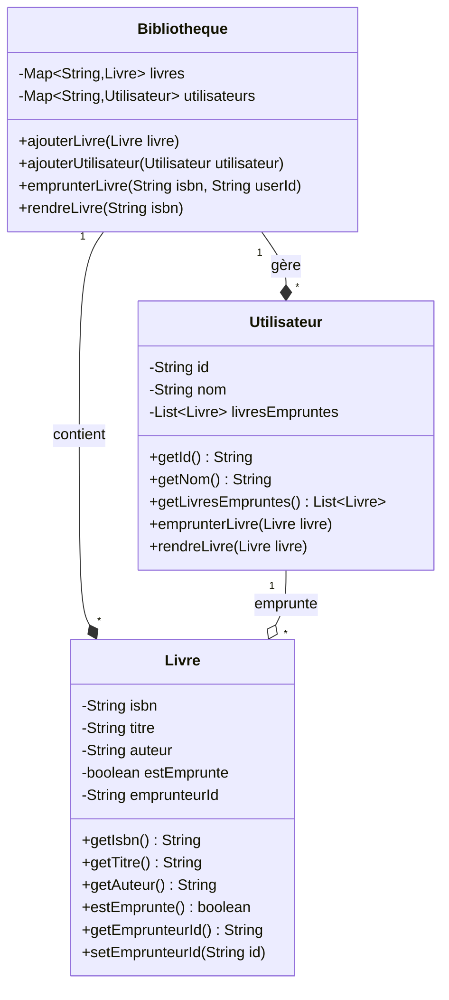

Je vous propose un exercice complet de programmation orientée objet (POO) en Java sur la gestion d'une bibliothèque. Cet exercice couvrira les concepts fondamentaux de la POO tout en créant une application pratique et utile.

### Contexte du Projet

Une bibliothèque municipale souhaite développer un système de gestion informatique pour ses livres et ses emprunts. Le système doit permettre de gérer les livres disponibles et suivre les emprunts des utilisateurs.

### Concepts POO à Mettre en Œuvre

1. Encapsulation :
  - Attributs privés avec accesseurs/mutateurs
  - Masquage des détails d'implémentation


2. Héritage :
  - Création d'une hiérarchie de classes
  - Réutilisation du code


3. Polymorphisme :
  - Redéfinition de méthodes
  - Utilisation d'interfaces


4. Abstraction :
  - Modélisation simplifiée de la réalité
  - Interfaces bien définies


Voici une implémentation complète d'un système de gestion de bibliothèque en Java utilisant la Programmation Orientée Objet (POO). Le système permet de gérer les livres et les utilisateurs, ainsi que leurs interactions.

Commençons par examiner la structure du système :



Dans ce diagramme :

- Les lignes avec le losange plein (--*) représentent une relation de composition : la Bibliothèque possède et contrôle le cycle de vie des Livres et des Utilisateurs
- La ligne avec le losange vide (--o) représente une relation d'agrégation : un Utilisateur peut emprunter plusieurs Livres, mais les Livres peuvent exister sans être empruntés
- La notation "1" -- "*" indique qu'une Bibliothèque peut contenir plusieurs (*) Livres et Utilisateurs, et qu'un Utilisateur peut emprunter plusieurs (*) Livres
- Les types génériques comme `List<Livre>` et `Map<String,Livre>` indiquent que ces collections contiennent respectivement des Livres et utilisent des Strings comme clés

Voici maintenant l'implémentation complète du système :

```java
public class Livre {
    private String isbn;
    private String titre;
    private String auteur;
    private boolean estEmprunte;
    private String emprunteurId;

    public Livre(String isbn, String titre, String auteur) {
        this.isbn = isbn;
        this.titre = titre;
        this.auteur = auteur;
        this.estEmprunte = false;
        this.emprunteurId = null;
    }

    public String getIsbn() { return isbn; }
    public String getTitre() { return titre; }
    public String getAuteur() { return auteur; }
    public boolean estEmprunte() { return estEmprunte; }
    public String getEmprunteurId() { return emprunteurId; }
    
    public void setEmprunteurId(String id) {
        this.emprunteurId = id;
        this.estEmprunte = (id != null);
    }
}

public class Utilisateur {
    private String id;
    private String nom;
    private List<Livre> livresEmpruntes;

    public Utilisateur(String id, String nom) {
        this.id = id;
        this.nom = nom;
        this.livresEmpruntes = new ArrayList<>();
    }

    public String getId() { return id; }
    public String getNom() { return nom; }
    public List<Livre> getLivresEmpruntes() { return livresEmpruntes; }

    public void emprunterLivre(Livre livre) {
        if (!livre.estEmprunte()) {
            livre.setEmprunteurId(this.id);
            this.livresEmpruntes.add(livre);
        }
    }

    public void rendreLivre(Livre livre) {
        if (livre.getEmprunteurId().equals(this.id)) {
            livre.setEmprunteurId(null);
            this.livresEmpruntes.remove(livre);
        }
    }
}

public class Bibliotheque {
    private Map<String, Livre> livres;
    private Map<String, Utilisateur> utilisateurs;

    public Bibliotheque() {
        this.livres = new HashMap<>();
        this.utilisateurs = new HashMap<>();
    }

    public void ajouterLivre(Livre livre) {
        this.livres.put(livre.getIsbn(), livre);
    }

    public void ajouterUtilisateur(Utilisateur utilisateur) {
        this.utilisateurs.put(utilisateur.getId(), utilisateur);
    }

    public void emprunterLivre(String isbn, String userId) {
        Livre livre = livres.get(isbn);
        Utilisateur utilisateur = utilisateurs.get(userId);
        
        if (livre != null && utilisateur != null && !livre.estEmprunte()) {
            utilisateur.emprunterLivre(livre);
        }
    }

    public void rendreLivre(String isbn) {
        Livre livre = livres.get(isbn);
        if (livre != null && livre.estEmprunte()) {
            Utilisateur emprunteur = utilisateurs.get(livre.getEmprunteurId());
            if (emprunteur != null) {
                emprunteur.rendreLivre(livre);
            }
        }
    }
}
```

Exemple d'utilisation :

```java
public class Main {
    public static void main(String[] args) {
        // Création de la bibliothèque
        Bibliotheque bibliotheque = new Bibliotheque();

        // Création de livres
        Livre livre1 = new Livre("978-123456789", "Le Petit Prince", "Antoine de Saint-Exupéry");
        Livre livre2 = new Livre("978-987654321", "Les Misérables", "Victor Hugo");
        
        // Ajout des livres à la bibliothèque
        bibliotheque.ajouterLivre(livre1);
        bibliotheque.ajouterLivre(livre2);

        // Création d'utilisateurs
        Utilisateur utilisateur1 = new Utilisateur("U001", "Jean Dupont");
        Utilisateur utilisateur2 = new Utilisateur("U002", "Marie Martin");

        // Ajout des utilisateurs à la bibliothèque
        bibliotheque.ajouterUtilisateur(utilisateur1);
        bibliotheque.ajouterUtilisateur(utilisateur2);

        // Emprunt d'un livre
        bibliotheque.emprunterLivre("978-123456789", "U001");

        // Retour d'un livre
        bibliotheque.rendreLivre("978-123456789");
    }
}
```

Cette implémentation offre les fonctionnalités suivantes :

- Création et gestion des livres avec leur ISBN unique
- Création et gestion des utilisateurs avec un ID unique
- Système d'emprunt qui vérifie si le livre est disponible
- Gestion du retour des livres
- Suivi des emprunts par utilisateur

Le système utilise les principes fondamentaux de la POO :

- Encapsulation : chaque classe encapsule ses données et son comportement
- Abstraction : les classes représentent des concepts réels de manière simplifiée
- Composition : la Bibliothèque contient des Livres et des Utilisateurs
- Association : les relations entre les classes sont clairement définies
