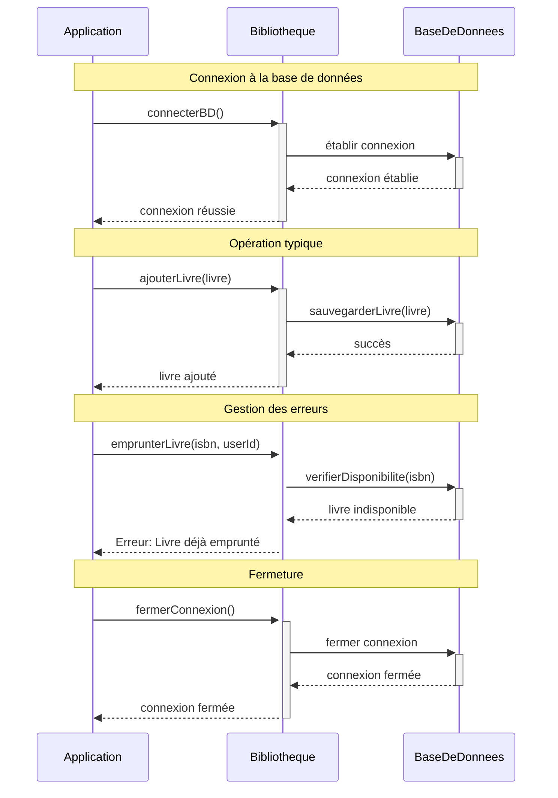

Pour intégrer votre système de bibliothèque avec une base de données MySQL, nous allons créer une couche de persistance qui gère la connexion et les opérations de base de données. Voici comment cela s'intègre dans l'architecture globale :



Ce diagramme montre les trois phases principales de l'interaction avec la base de données :

1. La connexion initiale à la base de données
2. Une opération typique (ajout d'un livre)
3. La gestion des erreurs (cas d'un livre déjà emprunté)

Les flèches pleines (-->) représentent les appels de méthode, tandis que les flèches pointillées (-->>) représentent les réponses. Les notes surmontant chaque section décrivent le contexte de l'opération.

Voici maintenant l'implémentation complète du système de persistance :

```java
public class BaseDeDonnees {
    private static final String URL = "jdbc:mysql://localhost:3306/bibliotheque";
    private static final String USERNAME = "root";
    private static final String PASSWORD = "votre_mot_de_passe";
    private Connection connexion;

    public void connecter() throws SQLException {
        connexion = DriverManager.getConnection(URL, USERNAME, PASSWORD);
    }

    public void fermerConnexion() {
        if (connexion != null) {
            try {
                connexion.close();
            } catch (SQLException e) {
                System.err.println("Erreur lors de la fermeture de la connexion : " + e.getMessage());
            }
        }
    }

    // Méthodes pour les livres
    public void sauvegarderLivre(Livre livre) throws SQLException {
        String requete = "INSERT INTO livres (isbn, titre, auteur, emprunteur_id) VALUES (?, ?, ?, ?)";
        try (PreparedStatement statement = connexion.prepareStatement(requete)) {
            statement.setString(1, livre.getIsbn());
            statement.setString(2, livre.getTitre());
            statement.setString(3, livre.getAuteur());
            statement.setString(4, livre.getEmprunteurId());
            statement.executeUpdate();
        }
    }

    public void mettreAJourLivre(Livre livre) throws SQLException {
        String requete = "UPDATE livres SET emprunteur_id = ? WHERE isbn = ?";
        try (PreparedStatement statement = connexion.prepareStatement(requete)) {
            statement.setString(1, livre.getEmprunteurId());
            statement.setString(2, livre.getIsbn());
            statement.executeUpdate();
        }
    }

    // Méthodes pour les utilisateurs
    public void sauvegarderUtilisateur(Utilisateur utilisateur) throws SQLException {
        String requete = "INSERT INTO utilisateurs (id, nom) VALUES (?, ?)";
        try (PreparedStatement statement = connexion.prepareStatement(requete)) {
            statement.setString(1, utilisateur.getId());
            statement.setString(2, utilisateur.getNom());
            statement.executeUpdate();
        }
    }

    // Méthode utilitaire pour vérifier la disponibilité d'un livre
    public boolean verifierDisponibilite(String isbn) throws SQLException {
        String requete = "SELECT COUNT(*) FROM livres WHERE isbn = ? AND emprunteur_id IS NULL";
        try (PreparedStatement statement = connexion.prepareStatement(requete)) {
            statement.setString(1, isbn);
            ResultSet resultat = statement.executeQuery();
            return resultat.next() && resultat.getInt(1) > 0;
        }
    }
}

public class Bibliotheque {
    private BaseDeDonnees baseDeDonnees;

    public Bibliotheque() {
        this.baseDeDonnees = new BaseDeDonnees();
    }

    public void connecterBD() throws SQLException {
        baseDeDonnees.connecter();
    }

    public void ajouterLivre(Livre livre) throws SQLException {
        baseDeDonnees.sauvegarderLivre(livre);
    }

    public void emprunterLivre(String isbn, String userId) throws SQLException {
        if (!baseDeDonnees.verifierDisponibilite(isbn)) {
            throw new IllegalStateException("Le livre n'est pas disponible");
        }
        
        Livre livre = new Livre(isbn, "", "");
        livre.setEmprunteurId(userId);
        baseDeDonnees.mettreAJourLivre(livre);
    }

    public void fermerConnexion() {
        baseDeDonnees.fermerConnexion();
    }
}
```

Pour utiliser ce système :

```java
public class Main {
    public static void main(String[] args) {
        Bibliotheque bibliotheque = new Bibliotheque();
        
        try {
            // Connexion à la base de données
            bibliotheque.connecterBD();
            
            // Création et ajout d'un livre
            Livre livre = new Livre("978-123456789", "Le Petit Prince", "Antoine de Saint-Exupéry");
            bibliotheque.ajouterLivre(livre);
            
            // Emprunt du livre
            bibliotheque.emprunterLivre("978-123456789", "U001");
            
        } catch (SQLException e) {
            System.err.println("Erreur lors de l'opération sur la base de données : " + e.getMessage());
        } finally {
            bibliotheque.fermerConnexion();
        }
    }
}
```

Points importants à noter :

1. **Configuration requise** :
          - MySQL doit être installé sur votre système
  - Le driver MySQL Connector/J doit être ajouté à votre projet
  - Créez la base de données avec les tables appropriées


2. **Structure de la base de données** :
```sql
CREATE TABLE livres (
    isbn VARCHAR(20) PRIMARY KEY,
    titre VARCHAR(255),
    auteur VARCHAR(255),
    emprunteur_id VARCHAR(20)
);

CREATE TABLE utilisateurs (
    id VARCHAR(20) PRIMARY KEY,
    nom VARCHAR(255)
);
```


3. **Sécurité et bonnes pratiques** :

- Utilisation de PreparedStatement pour prévenir les injections SQL
- Fermeture systématique des connexions avec try-with-resources
 - Gestion appropriée des exceptions
- Utilisation de constantes pour les paramètres de connexion


Cette implémentation permet de persister toutes les données de votre système de bibliothèque dans une base de données MySQL tout en maintenant la structure orientée objet que nous avons établie précédemment.
