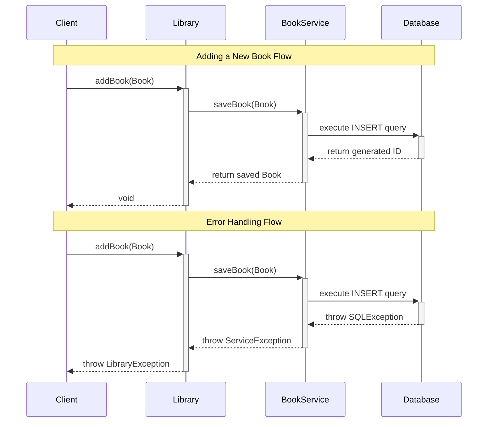
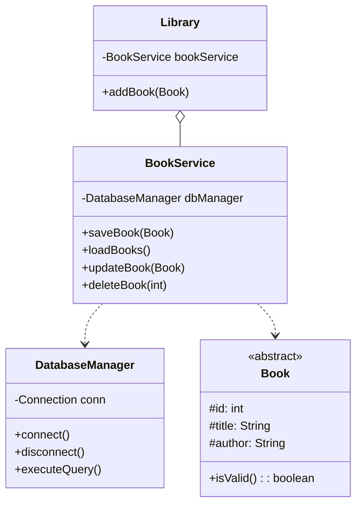

Let's enhance the Library Management System to include proper service layer integration with the database. Here's how we'll structure the solution:



The sequence diagram above illustrates two important flows:

1. **Success Flow** (top): Shows how a book addition request travels through layers, with each layer properly handling the response
2. **Error Flow** (bottom): Demonstrates proper exception propagation across layers

Solid arrows (→) represent method calls, while dashed arrows (-->) show returns/responses. The +/- symbols indicate activation/deactivation of components.

Now, let's look at how these components relate to each other structurally:



The class diagram shows the relationships between components:

- Solid diamond (◇) indicates Library owns BookService
- Dotted arrows (...) represent dependencies
- <<abstract>> marks Book as an abstract class
- # symbols indicate protected members

Here's the complete implementation of the service layer integration:

```java
public class Library {
    private final BookService bookService;

    public Library(BookService bookService) {
        this.bookService = bookService;
    }

    public void addBook(Book book) {
        if (!book.isValid()) {
            throw new IllegalArgumentException("Invalid book");
        }
        
        // Now we delegate persistence to the service layer
        bookService.saveBook(book);
    }
}

@Service
public class BookService {
    private final DatabaseManager dbManager;
    
    public BookService(DatabaseManager dbManager) {
        this.dbManager = dbManager;
    }

    public void saveBook(Book book) throws ServiceException {
        try {
            // Validate business rules
            validateBook(book);
            
            // Save to database
            dbManager.saveBook(book);
            
        } catch (SQLException e) {
            throw new ServiceException("Failed to save book", e);
        }
    }

    private void validateBook(Book book) throws ServiceException {
        if (book == null) {
            throw new ServiceException("Book cannot be null");
        }
        
        // Additional business validations can be added here
        if (book.getTitle() == null || book.getTitle().isEmpty()) {
            throw new ServiceException("Book must have a valid title");
        }
    }
}

@Repository
public class DatabaseManager {
    private final Connection conn;

    public DatabaseManager(String dbUrl, String username, String password) 
            throws SQLException {
        conn = DriverManager.getConnection(dbUrl, username, password);
    }

    public void saveBook(Book book) throws SQLException {
        try (PreparedStatement stmt = conn.prepareStatement(
                "INSERT INTO BOOKS (title, author, type, properties) VALUES (?, ?, ?, ?)",
                Statement.RETURN_GENERATED_KEYS)) {
            
            stmt.setString(1, book.getTitle());
            stmt.setString(2, book.getAuthor());
            stmt.setString(3, book.getClass().getSimpleName());
            stmt.setString(4, toJson(book));
            
            stmt.executeUpdate();
        }
    }

    private String toJson(Book book) {
        ObjectMapper mapper = new ObjectMapper();
        try {
            return mapper.writeValueAsString(book);
        } catch (JsonProcessingException e) {
            throw new RuntimeException("Failed to serialize book", e);
        }
    }
}

// Custom exceptions for better error handling
public class ServiceException extends RuntimeException {
    public ServiceException(String message, Throwable cause) {
        super(message, cause);
    }
}

// Usage example
public class LibraryManagement {
    public static void main(String[] args) {
        // Initialize dependencies
        DatabaseManager dbManager = new DatabaseManager(
            "jdbc:mysql://localhost:3306/library",
            "root", 
            "password"
        );
        
        BookService bookService = new BookService(dbManager);
        Library library = new Library(bookService);

        // Add a book
        DigitalBook ebook = new DigitalBook(
            1, 
            "Clean Code", 
            "Robert Martin", 
            "PDF", 
            500
        );

        try {
            library.addBook(ebook);
            System.out.println("Book successfully added");
        } catch (IllegalArgumentException e) {
            System.err.println("Invalid book: " + e.getMessage());
        }
    }
}
```

### Key Improvements Made

1. **Separation of Concerns**  - Library focuses solely on business logic
  - BookService handles persistence concerns
  - DatabaseManager encapsulates database operations


2. **Dependency Injection**  - Constructor injection for dependencies
  - Clear dependency relationships
  - Easier testing through mocking


3. **Robust Error Handling**  - Custom exceptions for different error types
  - Proper exception propagation
  - Detailed error messages


4. **Validation**  - Business rule validation in service layer
  - Input validation before database operations
  - Consistent validation patterns


This implementation follows SOLID principles and provides a clean separation between business logic and data persistence, making the system more maintainable and testable.
